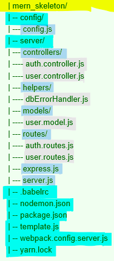

#MERN BACKEND

Steps to install the MERN backend:
1. set up project folder 
2. Install and configure necessary Node modules 
3. prepare run scripts 
4. implement an Express server
5. implement a user model with mongoose 
6. implement API endpoints with Express router
7. implement JWT-based authentication

#1. Folder and File Structure for MERN backend 
- this creates a functioning, stand alone server-side app:

- root directory: configuation files
- server folder: back-end code 
    - divide into: models, controllers, routes, helpers, common server-side code 

-* moved server.js into server folder for organization
    - make sure to update any files that reference server.js with updated paths: 
        - server-side: - package.json (main, dev, start)
                       - server.js (path for static files, catch-all route, assets-router)
        - client side: package.json (dev)
        - in vite.config.js I had to change the root from '.' to './client' or else the front-end would not work server side